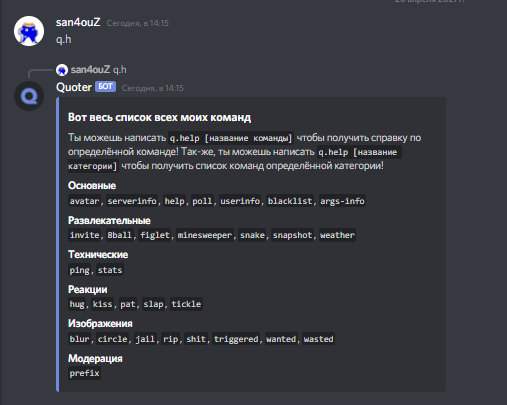

# Команды


В данной статье префикс изображен в виде `<prefix>, его необходимо заменить на префикс вашего сервера`

`Необходимые аргументы указаны в <>, необязательные указаны в []`



Все команды имеют своё название и синонимы и вводятся они так:  
`<prefix><name/alias> [arguments]/<arguments>`


## Примеры

### Команда с текстовым аргументом

```
<prefix>help [команда/категория]
```

#### Использование команды без аргументов вернёт все команды бота  



#### Если указать определённую команду - выведется справка команды  


#### Если указать категорию, бот вернёт команды и их описание этой-же категории  


